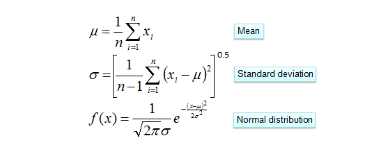

# cryptocurrency-price-forcaster
- This application was curated as Capstone project for obtaining my undergraduate degree in Computer Science. 
- The premise of the application was to utilize "Machine Learning" in a prescriptive fashion to ascertain future price predictions of Cryptocurrency assets. 
- The application is housed within this Mono Repo containing both the frontend and backend code.

### Installation/Use:

#### Prerequisites (Dockerized Application):
- Just Docker and docker compose! 
- Versions:
    - Docker version:  >= 20.10.16
    - Docker Compose Version: >= v2.3.3  
- Installation documentation for docker:
    - [Docker Compose](https://docs.docker.com/compose/install/)
    - [Docker]()

#### Prerequisites (Running code locally/local environment):
- Yarn (package manager for Javascript/Node)
- Golang Version 1.18
- Nvm (v17.9.0) you will need to ensure you utilize NVM using the given node version.

### Local Environment:
1. Change directory into the project directory from a terminal or cli: ```cd project```
2. You must first run ```cd frontend``` into the frontend directory then run ```yarn install``` to install all necessary libraries for the Vue application. 
3. Next, ```cd``` back to the root directory with ```cd ..``` and then cd into the backend directory with ```cd backend```. 
4. After entering the backend directory, you can install all necessary Golang packages with ```go mod download```
5. Next we will use the Makefile and the make command to build the project.
6. The Make is a simple method of building/executing the necessary elements for the code to run.
- <b>Note</b>: If using the local environment you first must install the necessary components above within the “local environment” label and perform the previous steps!
7. Next, make sure you are in the root of the capstone folder where the Makefile is present. 
8. To run the Makefile for local execution, use the makefile command: ```make dev_local```

#### Dockerized:
- <b>NOTE</b>: You will need to use the links above to ensure that Docker and docker compose are both installed prior to running these commands.
Change directory into the project directory from a terminal or cli: cd capstone
Just run the Makefile command: make dev_docker

#### Environment:
- Note: It is strongly recommended to utilize the dockerize environment as docker will build out the necessary containers, networks, and host the application binding the sports 3005 and 8080 for us of the Golang API (port 3005) and Vue3 frontend(port 8080) for simple testing and east of use.
- The Golang API executes on port 3005 on localhost (127.0.0.1)
- The Vue3 Frontend will be bound to port 8080.
- One can interact with the application (after standing the frontend and backends) via going to http://127.0.0.1:8080
- <b>Note</b>: If running the application locally, you will need to use NVM for node version management.
- Use ```nvm install 17.9.0``` to install the working version of node for this project.
#### Core Compoments:
- The backend code is housing the primary algorithms utiilized for curating the price predictions. 
- The price predictions are curated using the mean, standard deviation, and normal distrubution of the dataset, which is the OHLC data of a selected crypocurrency. 
- This is performed via an implementation of the Naieve Gaussian Bayes algorithm. 
- The mathmatical equations used can be seen within the "algorithm" package within the Backend code.
- The mathmetical equatinos:


#### Frontend:
- The frontend application is a stupendously basic UI that is meant to allow base user interaction with the various elements of the application.
- the following are some screenshots of interacting with the system:

### User Guide
1. After the application has been started (via either the dockerized environment or the local setup) the user can browse to the address for localhost http://127.0.0.1:8080,

- You will then fall upon the landing page of the application.

- The links above which will take you to the primary pages in the application. Moving onto the Data Dashoard, the user will be greeted with the following view:

- Here we can see several visual components displayed, showing us the top 7 trending cryptocurrencies in a table, followed by the bar graph comparing the prices of the trending currencies and the volume pie charts showing the volume each currency holds in the market.   
Note: Some coins DO have much larger volumes or much lower prices than others being displayed. This may cause some unique graphs to appear.
The Pie chart is interactive, where if you only desire to see a subset of coins, you can select them by clicking on the name of the coin above the pie chart. 

- This allows you to modify the view to your liking.

2. Moving to the Price Dashboard page, you will see the following page loaded: 

3. Upon selecting a token, the candlestick chart will appear using the OHLC data from the selected token:
- You can interact with the candlestick chart using the icons in the upper right corner.

- Lastly, and more importantly,  you can use the button on the bottom center to request pricing prediction using the machine learning model of the application. The button, when clicked, will force you to accept a EULA:
 
- After accepting the Disclaimer, you will see the probability table appear after the machine learning model has provide the feedback data:

